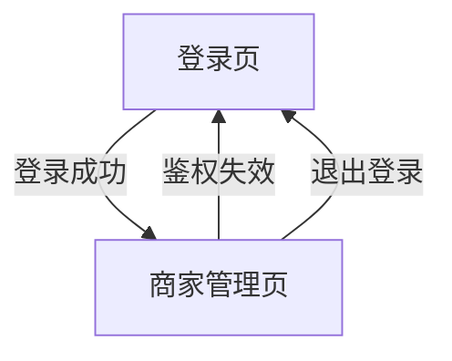

## 1. Product Overview
“超级管理系统”是一个面向内部运营/超级管理员的后台 Web 系统，用于登录后对商家进行统一管理。
系统仅包含“登录”和“商家管理”两类核心能力，并对接既有后端接口完成鉴权与请求头约束（`X-Store-Id=0`）。

## 2. Core Features

### 2.1 User Roles
| Role | Registration Method | Core Permissions |
|------|---------------------|------------------|
| 超级管理员 | 账号由后端/组织预置；通过登录页登录 | 登录系统；查看/新增/编辑/启停用商家；退出登录 |

### 2.2 Feature Module
本系统由以下必要页面构成：
1. **登录页**：账号密码登录、鉴权信息持久化、登录态校验与跳转。
2. **商家管理页**：商家列表查询、分页、查看详情、商家新增/编辑、启用/停用。

### 2.3 Page Details
| Page Name | Module Name | Feature description |
|-----------|-------------|---------------------|
| 登录页 | 登录表单 | 输入账号/密码并提交；展示校验错误与登录失败提示；登录成功后保存鉴权信息（按接口返回为准）并跳转到商家管理页 |
| 登录页 | 登录态处理 | 在进入登录页时检测是否已登录；已登录则直接跳转商家管理页；提供“退出登录”时清理本地鉴权信息 |
| 商家管理页 | 顶部栏 | 显示系统名称与当前用户；提供退出登录入口 |
| 商家管理页 | 查询与过滤 | 按关键词（如商家名称/编号等，以接口支持为准）查询；支持重置查询条件 |
| 商家管理页 | 商家列表 | 表格展示商家核心字段（以接口返回为准）；展示加载中/空数据/请求失败状态 |
| 商家管理页 | 分页 | 支持分页切换与页大小（若接口支持）；保持查询条件不丢失 |
| 商家管理页 | 商家新增/编辑 | 通过弹窗/抽屉打开表单；提交创建或更新请求；成功后刷新列表并给出提示；失败时展示后端错误信息 |
| 商家管理页 | 启用/停用 | 对单个商家执行启用/停用；二次确认；成功后刷新列表 |
| 全局 | 接口鉴权与请求头 | 所有接口请求自动附带鉴权信息（按接口要求，如 `Authorization`）；所有请求统一附带 `X-Store-Id: 0` |
| 全局 | 鉴权失效处理 | 接口返回鉴权失效时（如 401/自定义错误码）清理本地鉴权信息并跳转登录页 |

## 3. Core Process
**超级管理员流程**
1. 打开系统，若未登录则进入登录页。
2. 输入账号与密码提交登录；登录成功后进入商家管理页。
3. 在商家管理页进行查询、分页浏览；可新增商家、编辑商家信息、启用/停用商家。
4. 点击“退出登录”，清理登录态并回到登录页。

