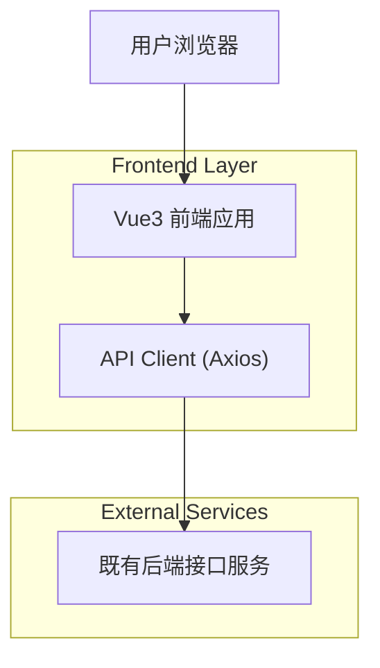

## 1.Architecture design

## 2.Technology Description
- Frontend: Vue@3 + vite + vue-router + pinia + axios
- Backend: None（直接对接既有后端接口）

## 3.Route definitions
| Route | Purpose |
|-------|---------|
| /login | 登录页：完成账号密码登录与登录态建立 |
| /merchants | 商家管理页：商家查询、列表分页、商家新增/编辑、启用/停用 |

## 4.API definitions (If it includes backend services)
本项目不新增自建后端服务；仅封装前端 API Client 来调用“给定接口”。

**鉴权与请求头约束（关键）**
- 登录成功后：按接口返回内容保存鉴权信息（例如 token / session / cookie，具体以接口为准）。
- 发送业务请求时：通过 Axios 请求拦截器统一注入
  - 鉴权信息：按接口约定注入到请求头（例如 `Authorization: Bearer <token>`，以实际接口要求为准）。
  - 固定头：`X-Store-Id: 0`（所有请求必须携带）。
- 鉴权失效：通过 Axios 响应拦截器统一处理
  - 若后端返回 401 或约定的“未登录/过期”错误码：清理本地鉴权信息并跳转 `/login`。

**前端 API 封装建议（不使用 TS）**
- `src/api/http.js`：创建 axios 实例、拦截器、统一错误处理。
- `src/api/auth.js`：封装登录接口调用（login）。
- `src/api/merchant.js`：封装商家管理相关接口调用（list/create/update/enable/disable 等，具体方法以接口清单为准）。

## 6.Data model(if applicable)
本项目不自建数据库；数据模型由既有后端接口定义并返回，前端按接口字段进行渲染与表单提交。